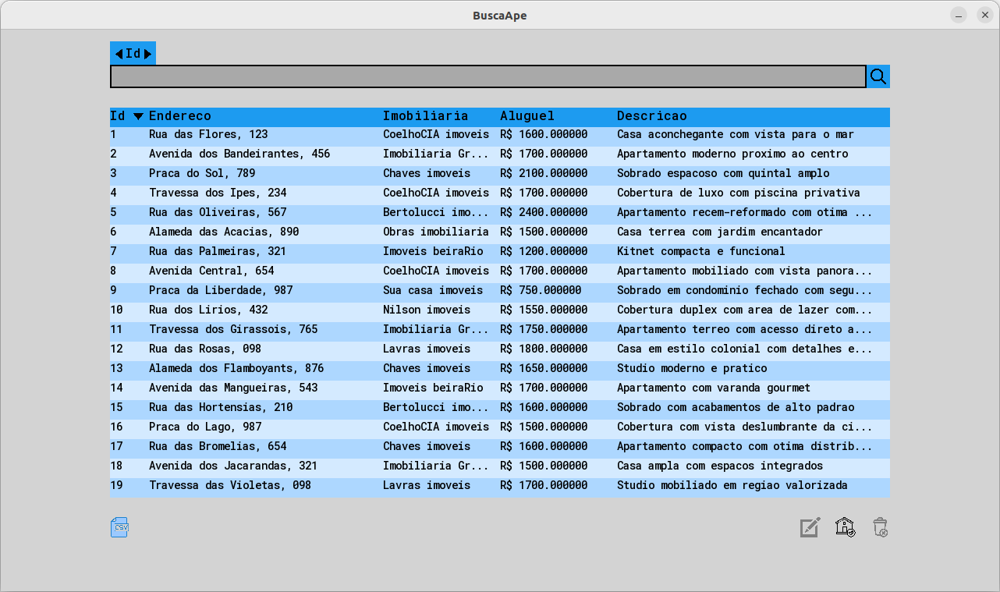
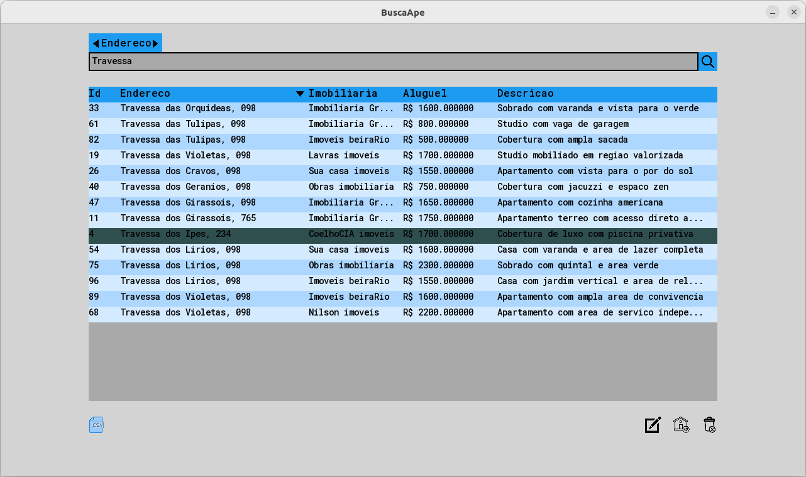
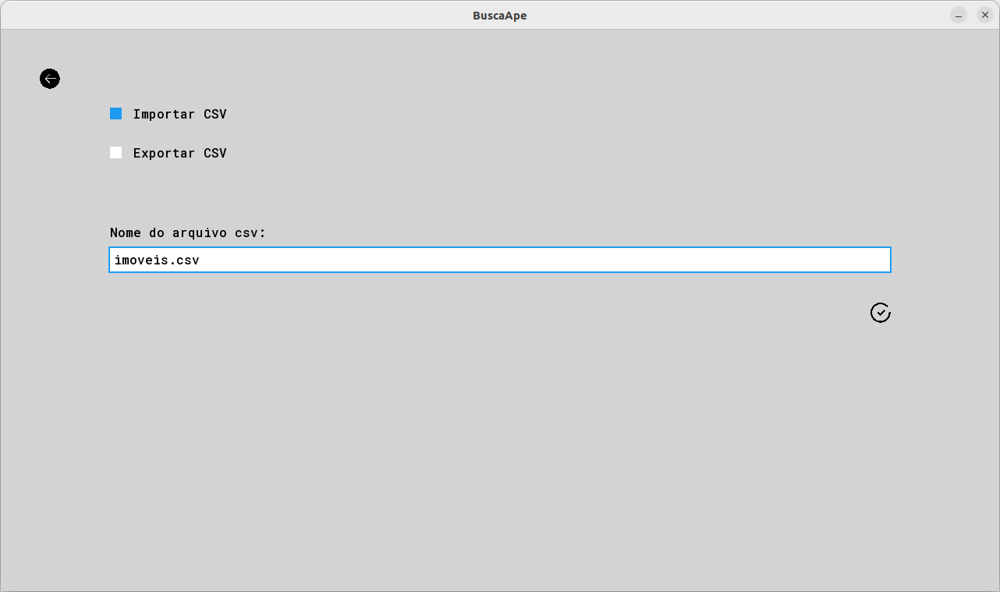
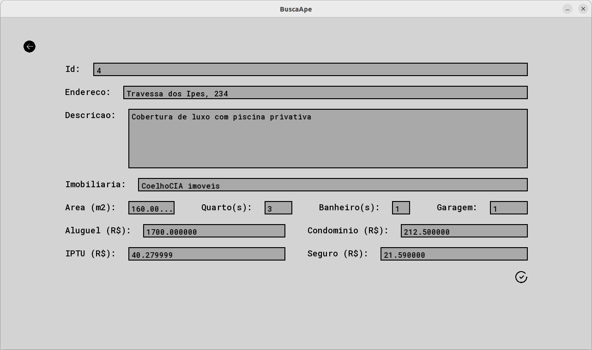

# BuscaApê

## O maior indexador de imóveis disponíveis para locação !!!

Projeto desenvolvido para a disciplina de Introdução aos Algoritmos, ofertada pela UFLA.

## Sobre o projeto

O objetivo deste trabalho é implementar um sistema de cadastro (com recursos para busca e alteração de dados) com armazenamento dos dados em arquivos binários.

No caso, foram escolhidos registros de imóveis.

### Página principal

&nbsp;

### Página Importar/Exportar arquivo .CSV

&nbsp;

### Página alterar/criar registro

&nbsp;

## Requisitos definidos

1. Os dados devem ser armazenados em um arquivo tipado, mas com capacidade de importação e exportação dos dados para o formato CSV.

1. Deve ser possível ordenar os dados por pelo menos dois dos campos  do registro. No exemplo dado, a aplicação poderia dar a opção de ordenar por nome ou idade. A ordenação deverá ser feita em memória (todos os dados do arquivo são lidos em um vetor na memória, ordenados e então novamente gravados no disco). Para ordenação, deverá ser utilizado um dos métodos eficientes: quick sort, merge sort ou shell sort.

1. A aplicação deverá ser capaz de remover dados existentes diretamente no arquivo. Recomendamos que a remoção seja feita de forma lógica, ou seja: o objeto não é apagado diretamente do arquivo, mas apenas marcado (com uma chave negativa, por exemplo). Nesse caso, o espaço pode (e deve) ser utilizado em uma futura inserção. O elemento também deve ser removido totalmente quando o arquivo for novamente reordenado.

1. Deve ser possível inserir um novo elemento. Nesse caso, a inserção será realizada ou no final do arquivo, ou sobrescrevendo algum dado marcado como removido. Opcionalmente, vocês também podem optar por fazer uma inserção ordenada, para facilitar o uso de busca binária (ou seja, o elemento é inserido de forma a manter os dados ordenados).

1. Deve ser possível buscar um registro, utilizando-se um dos campos. Nesse caso, deve ser possível fazer a busca por pelo menos duas formas diferentes  (no nosso exemplo: por nome ou por idade ou por endereço). A busca, que pode ser binária ou sequencial, deve ser realizada diretamente no arquivo binário. Note, que para fazer busca binária, os dados deverão estar ordenados.

1. Deve ser possível imprimir tanto o arquivo inteiro, como um trecho informado pelo usuário. Por exemplo, deve ser possível imprimir do décimo ao vigésimo elemento do arquivo. A impressão deve ser realizada na ordem em que estão armazenados. Para uma impressão ordenada, é necessário, portanto, ordenar o arquivo primeiro.

